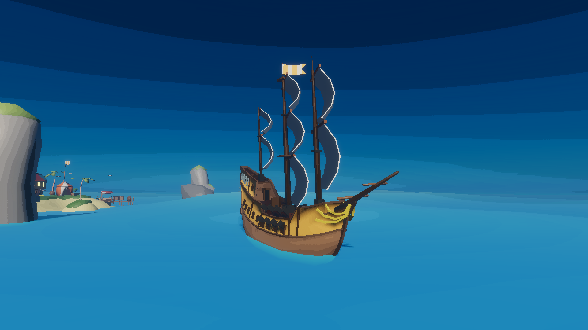

# unity-sail

Unity-sail is the repository for `Project Sail`, an open world naval-combat and exploration game set in the pirate age.

## Version History

### Alpha_1.2.2 (Quality of Life 2):
August 29, 2022
- Allow user to quickly scroll item values by holding increment button
- Added missing map icons (Crooks Cove, Shark Tooth Cove, Skull Isle, Scimitar Rock, Grand Fort)
- Changed item weights (food=10, wood=2, cannonball=1, treasure=20)
- Changed ship capacities [100, 200, 400, 800]
- Updated food effects - 1 food lasts 1 minute
- Updated wood effects - 1 wood heals 10hp
- Added custom UI cursor
- Added custom aim cursor
  - Indicates if target is in range of cannons
  - Indicates target distance
- Improved player aim (lead moving targets, account for player velocity) - needs work
- Added toggleable camera smoothing
- Fixed hunger bug (Food lasts longer than specified)

### Alpha_1.2.1 (Quality of Life):
August 09, 2022
- Added display settings
- Added resolution settings
- Added volume settings
- Added island visit banners
- Added item pickup indicators
- Staggered cannons when firing (in random order)

### Alpha_1.1 (Map Update):
July 13, 2022
- Added SFX infrastructure
- Added music player state machine
- Added Crooks Cove
- Added Skull Isle
- Added Grand Fort
- Added Scimitar Rock
- Added obstacle islands
- Added mainland with river
- Added random and dynamic wind direction
- Expanded map boundaries
- Adjusted fog appearance

### Alpha_1.0 (AI Update):
June 15, 2022
- Added distributed task queue
- Queue AI decision tasks (performance optimization)
- Revised AI ship behaviour:
  - Raise sails once goal is reached
  - aggressive AI can also seek a goal
  - aggressive AI with a goal will attack a player if they come too close
  - aggressive AI will stop chasing the player after some time
- Added simple physics based pathfinding scheme to AI ships
- Added proximity AI loader (deactiviate distant ships)
- Added deactivated AI simulator (simulate movement of unloaded ships)
- Re-added fort turrets
  - Fort turrets deactivate if the player is far away
  - Destroyed turrets respawn if the player visits the home island
- Added fort turret (temporary) to Palm Isle
- Added patrol ships (temporary) to Beacon Hill 

### Dev_1.5:
May 29, 2022
- Added new prop assets (tent, cartographer tent)
- Added Chip Tooth Cove
- Added Galleon player ship
- Added ability to hide UI `F2`
- Added ability to take screenshots `F1`
- Added navigation data (collect when visiting new islands)
- Added cartographer to home island (convert nav data into islands on map, and coins)
- Added clock to HUD
- Added AI ship route system - encode AI ship routes in the present, and routes to take place in the future
- Added AI ship route generator - AI ships passively (and randomly) sail routes through the world

### Dev_1.4:
May 17, 2022
- Added new prop assets (small temple, special treasure, bottle)
- Added brig player ship
- Added beacon hill
- Added note pickups which can be displayed through notes modal
- Added randomly spawning island treasure
- Added randomly spawning treasure maps -> show special treasure locations on map
- Added island visit event system

### Dev_1.3:
May 10, 2022
- Added new prop assets (shipwreck, driftwood)
- Added Crab reef
- Added game menu
- Added options to game menu (includes UI scale)
- Save options universally across game saves
- Added map (shows player position, islands)
- Added border colliders to world

### Dev_1.2:
- Added ship yard for ship upgrades
- Added new prop assets (broken dock, foliage, rocks, campfire, barrels, crates)
- Added 3 new islands (Rocky cove, Palm islse, Banana cay)
- Added 3 new ship types (tiny ship, Cog, Sloop)
- Added randomized item drops to destroyed enemies
- Added compass to HUD
- Updated main menu UI and background
- Prevented player from opening new modals when a modal is already open
- Added event driven player input (rather than checkinf or input every frame across many components)
- Player respawn after death uses centralized player ship manager
- Player unable to open shop modals when outside of safe zone

### Dev_1.1:
- Added day/night cycle
- Added toon shading
- Added item shop
- Disable player cannons in safe zone
- Made debug info toggleable `F3`
- Fixed food generation glitch (used drop items menu)
